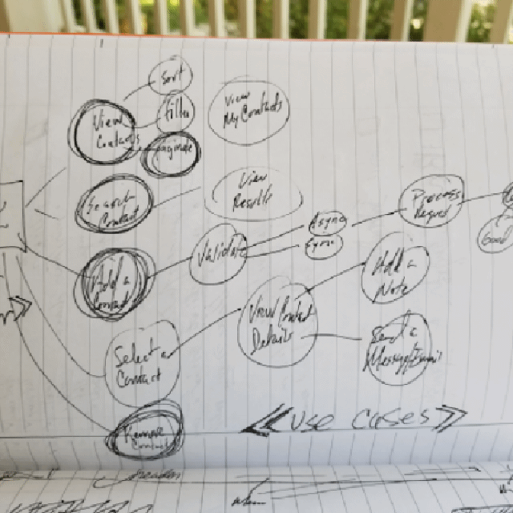
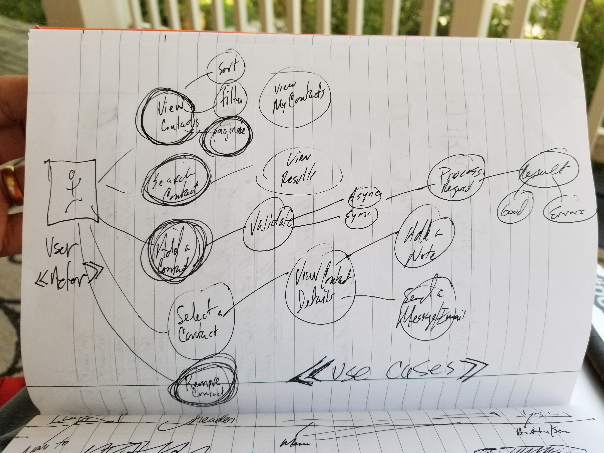

# Quicken :: Brand Marketing Code Test

This repository contains the application code and information on the steps taken to create the solution. See the [Brand Marketing Code Test](brand-marketing-code-test.md) for information and criteria for the code challenge.

- Technical details located in the [Workspace REAME.md](./workspace/README.md)
- The [server application documentation](./workspace/apps/contacts/README.md)
  - NestJS
  - Node/Express
  - AWS API Gateway
  - Lambda Functions
  - DynamoDb database

## Experience and Planning

Before executing or writing any code I went through a series of exercises to help me get define and organize the information about the project.

1. actor and use cases
2. ideation
3. goal and objective
4. requirements and definitions
5. models
6. wireframe
7. architecture planning
8. API planning

## Use Cases

The user needs/wants to use the application in the following ways. There is a set of default criteria for the test. These items are a _must have_ and should be part of the MVP solution. The code test also indicates that additional behaviors are acceptable.

- view contacts
  - sort contacts
  - filter contacts
  - page through larger lists of contacts
  - view the _user's_ contacts
- search contacts
  - view results/contacts
- Add a contact
  - verify and validate (process)
  - receive notification of successful operation
  - receive notification of error messages if unsuccessful
- select a contact
  - view details of the contact
  - add a note
  - or, send an email message to contact
- remove a contact
  - receive notification of successful operation
  - receive notification of error messages if unsuccessful

## Code and Solution

The solution is an Angular Workspace that supports multiple projects in a single developer environment.

- application projects
  - Angular SPA for browser clients
  - NestJS server application to host Controller APIs
    - AWS API Gateway
    - AWS Lambda Function
    - AWS DynamoDb Database
- library projects
  - Angular libraries
    - error handling
    - configuration
    - logging
    - business actions
    - HTTP services
    - rules engine
    - notifications
  - NestJS libraries
    - Web API controllers and services
    - domain logic
    - data repositories
    - data access
